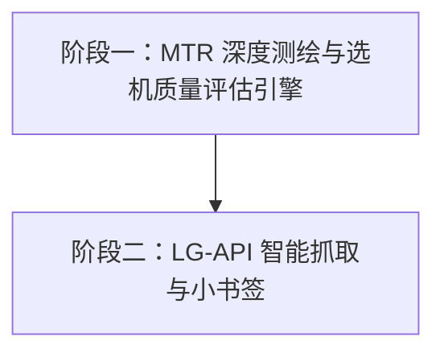

# 🚀 VPS 跨境路由综合测绘平台 - 架构演进与开发路线图 (ROADMAP)

本文档记录了关于项目后续功能演进（MTR 深度测绘、LG-API 自动抓取）的讨论成果、架构隔离策略及阶段性开发路线。

---

## 🎯 1. 核心初衷与定位

本项目的核心初衷是**解决 VPS 商家 Looking Glass (LG) 仅支持单节点测试的痛点**。
通过提供纯前端批量测绘能力，帮助用户一次性测试全国三网（电信、联通、移动）核心枢纽节点，高效挑选符合个人需求的 VPS 服务器。

- **Traceroute（当前功能）**：解决**“看线路类型（下限）”**的问题（识别 CN2 GIA/9929/CMIN2 及地理绕路）。
- **MTR（新增规划）**：解决**“看线路稳定性与质量（上限）”**的问题（识别晚高峰丢包率 `Loss%` 和延迟抖动 `StDev`）。
- **LG-API 自动抓取（新增规划）**：解决**“数据输入门槛与繁琐度”**的问题（免去 F12 抓包流程）。

---

## 🛡️ 2. 零破坏性更新架构策略 (Zero-Regression Strategy)

为了确保新版本的开发**100% 不影响现有在线版本的稳定运行**，项目将严格遵循以下工程隔离原则：

### ① 代码架构隔离（Feature Flag & 物理隔离）
- **默认保持现状**：界面与引擎默认停留在 **`Traceroute 模式`**。不触发新逻辑时，100% 走原有数据流。
- **模式开关**：新增 `[ ⚡ 极速 Traceroute (默认) | 📊 深度 MTR 测绘 ]` 开关。只有主动切到 MTR 模式才触发新请求逻辑。
- **解析引擎隔离**：保留原有的 `analyzeRoute` 函数不动，新增独立的 `parseMtrLog` 函数专门处理 MTR 格式日志。

### ② Git 分支管理策略
- **`main` 分支**：保持生产环境 100% 稳定，仅在功能通过全面测试后进行合并。
- **`feature/mtr-support` 分支**：所有 MTR 深度测绘功能在此分支独立开发与测试。
- **`feature/auto-api` 分支**：自动抓取与小书签功能在此分支独立开发。

---

## 🗓️ 3. 阶段性开发路线图 (Development Roadmap)

### 📌 阶段一：MTR 深度测绘与选机质量评估 (Phase 1)
> **目标**：建立支持批量 MTR 的质量诊断引擎，解决“丢包率”与“稳定性”量化评估。

- [x] **1.1 分支与开关建立**：创建 `feature/mtr-support` 分支，在 UI 增加模式切换开关。
- [x] **1.2 MTR 请求构造与轻量化发包**：
  - 支持 Payload 中注入 MTR 参数（默认控制发包数 `-c 5` 或 `-c 10`，兼顾速度与准确度）。
  - 支持设置接口超时与优雅降级（如 LG 不支持 MTR 则退回 Traceroute）。
- [x] **1.3 MTR 日志解析器 (`parseMtrLog`)**：
  - 提取路径 ASN、骨干网特征及地理走向。
  - 核心提取：**`Loss%`（丢包率）**、**`Avg`（平均延迟）**、**`StDev`（抖动）**。
- [x] **1.4 批量测试结果大表升级**：
  - 批量测试卡片/总览中呈现 `丢包率` 字段。
  - 增加丢包率直观高亮预警（🟢 0% 优秀 | 🟡 <5% 良好 | 🔴 >10% 拥堵避坑）。
- [x] **1.5 回归测试与合并**：确认老功能零受损、新功能正常后，合并至 `main`。

---

### 📌 阶段二：LG-API 智能抓取与小书签 (Phase 2)
> **目标**：彻底免去 F12 抓包步骤，提供“一键抓取”与“常见 LG 智能推理”。

- [x] **2.1 LG 嗅探引擎**：支持主流面板（如 WHMCS/HostBill）LG 页面的 API 接口自动识别与提取。
- [x] **2.2 小书签 (Bookmarklet) 联动注入**：
  - 提供可拖拽至书签栏的 JS 脚本。
  - 用户在商家 Looking Glass 页面点击书签，自动提取当前/所有地点的 API 地址及 Payload，并带入本工具。
- [x] **2.3 商家多机房横向矩阵比拼**：
  - 支持一键提取商家所有子域名/机房列表（如 London, Frankfurt, Istanbul），实现商家“全机房 vs 中国三网”的对比测试。

---

*文档创建时间：2026-08-07*  
*维护状态：持续更新中*
